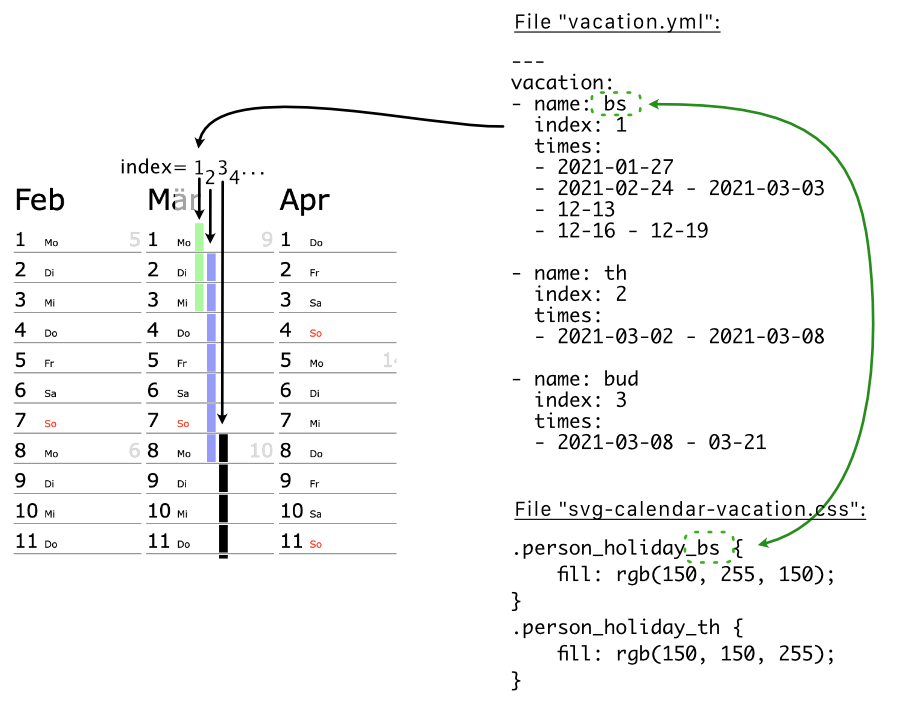

# svg-calendar

Creates an image of an annual calendar (kind of a wall calendar).
The calendar is saved as a .svg file.


How to create the calendar file
===============================

Review the following files

- week_markers.txt: place markers (example: place a "C" on 3rd week of this year)
- day_markers.txt: place markers on single days
- highlight_days.yml: format specific days using CSS (example: background color of Dec 24th)
- vacation.yml: person's vaction
- svg-calendar.css: CSS definitions for the SVG file
- holidays.yml: holiday data

Create the .svg file by running

`perl svg-calendar.pl > test-calendar.svg`

Open file `test-calendar.svg` in a browser.


Sample
======

See sample output in file `sample-calendar.svg`.


File vacation.yml
=================

The index value influences the vertical bar. The higher the index value is, the
more the bar moves to the right. I think an index value greater 5 isn't suitable
at the moment, otherwise the vertical bar overlaps the next month.

The color of the vertical bar can be changed in the CSS file. By default, the
bar is black. Having an element `name: bs` in the YML file, you can change the
styling by setting `.person_holiday_bs` in the CSS file.



Vacation can be specified using the following formats:

- `yyyy-mm-dd - yyyy-mm-dd`: from (first day), to (last day)
- `yyyy-mm-dd - mm-dd`: same as before, omitting the year in 2nd part
- `yyyy-mm-dd`: only on this day
- `mm-dd - mm-dd`: from (first day), to (last day) omitting the year
- `mm-dd`: only on this day, omitting the year

Command line switch: `-vacation vacation.yml`


File highlight_days.yml
=======================

You can format a day's cell using css code, or you can add notations.


Command line switch: `-highlightdays highlight_days.yml`


File holidays.yml
=================

Defining (public) holidays. The weekday text is formatted using CSS
`text.holiday`.

You can specify entries using the format YYYY-MM-DD.
Also, for recurring holidays (on a fixed day each year), the format MM-DD
is also valid.


Command line switch: `-holidays holidays.yml`


File day_markers.txt
====================

The following example will place an "X" on January 8th: `2021-01-08   X`

Command line switch: `-daymarker day_markers.txt`


File week_markers.txt
=====================

The following example will place an "A" on the 3rd week of the year: `3   A`.
The Text is placed inside the Wednesday's box of that week.

Command line switch: `-weekmarker week_markers.txt`


Developer hints
===============

Run `while true ; do make ; sleep 1 ; done`


Requirements
============

The following perl libraries have to be installed:

- POSIX
- Time::Piece
- YAML::Tiny


Run tests
=========

You can run some simple tests using the Test::More library. The test files are
placed in the ./t directory. Just run `make test`. Example:

```
% make test
prove t/
t/00-sanity.t ....... ok
t/10-syntax.t ....... ok
t/20-year-tests.t ... ok
t/21-no-cli-args.t .. ok
t/22-leap-year.t .... ok
All tests successful.
Files=5, Tests=15,  0 wallclock secs ( 0.03 usr  0.01 sys +  0.41 cusr  0.08 csys =  0.53 CPU)
Result: PASS
```
